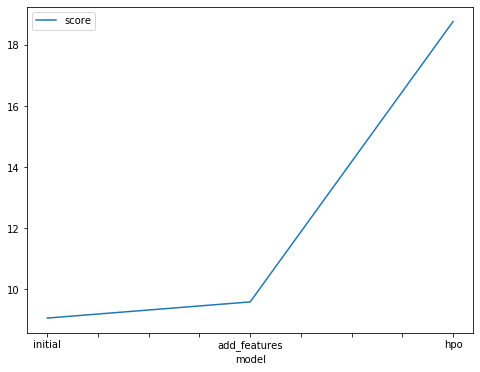

# Report: Predict Bike Sharing Demand with AutoGluon Solution
#### Abdelrahman Ali Ali

## Initial Training
### What did you realize when you tried to submit your predictions? What changes were needed to the output of the predictor to submit your results?
I realized that some of the predictions has negative values and Kaggle doesn't accept the negative values so i assigned the values with zero.

### What was the top ranked model that performed?
The best model is the second one, after feature engineering.

## Exploratory data analysis and feature creation
### What did the exploratory analysis find and how did you add additional features?
After plotting histogram we found that most of the bike riders not ride in holidays, and the same in the working day.
when the humidity increases the number of riders increases, the most number of riders at weather 0 and the windspeed average is 12.5 km/hr.

The additional features is extracting hours, days, and months for the datetime column as we convert it to a datetime type.

### How much better did your model preform after adding additional features and why do you think that is?
Its performed better after adding the additional features. the score reduced from 1.39401 to 0.47014. That's a 60% improvement.
(WeightedEnsemble)

## Hyper parameter tuning
### How much better did your model preform after trying different hyper parameters?
The model performed slightly not good as it decreases from 0.47014 to 0.63376.

### If you were given more time with this dataset, where do you think you would spend more time?
I'll spend much more time in EDA and understand the dataset very well to answer more and more buisness questions.
I'll try more models like DecisionTrees, XGBoost, RandomForest, ANN.

### Create a table with the models you ran, the hyperparameters modified, and the kaggle score.
|model|hpo1|hpo2|hpo3|score|
|--|--|--|--|--|
|initial|900|600|900|1.39401|
|add_features|100|50|20|0.47014|
|hpo|5|20|10|0.63376|

### Create a line plot showing the top model score for the three (or more) training runs during the project.

Replace the image below with your own.

### Create a line plot showing the top kaggle score for the three (or more) prediction submissions during the project.

Replace the image below with your own.

## Summary
Add your explanation
This is about Go to the bike sharing demand usecase. we walkthrough some steps from understanding the data and EDA with feature engineering and applying AutoGloun model with initial dataset, with feature enginnering modification, and with custom hyperparameters.

1- We read the data from the csv files.
2- Train and evaluate the model with the initial parameters.
3- check if there is negative.
4- Doing some feature engineering (Extract hours, days, months from datetime column)
5- Train and evaluate the model with the initial parameters.
6- check if there is negative.
7- Train the model but this time with hyperparameters.
8- check if there is negative.
9- compare between the three models(WeightedEnsemble).